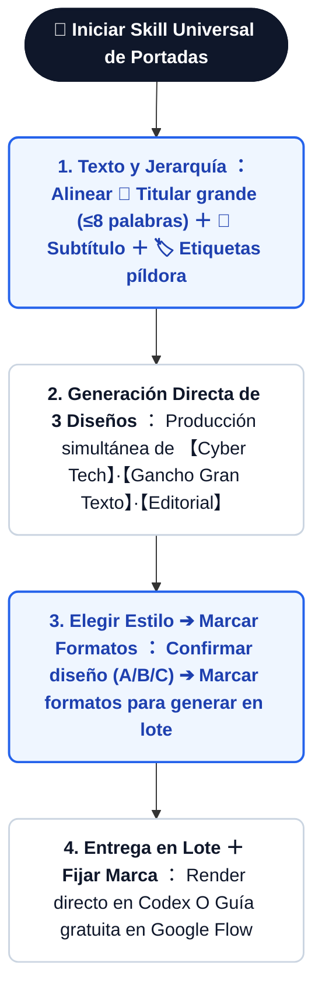
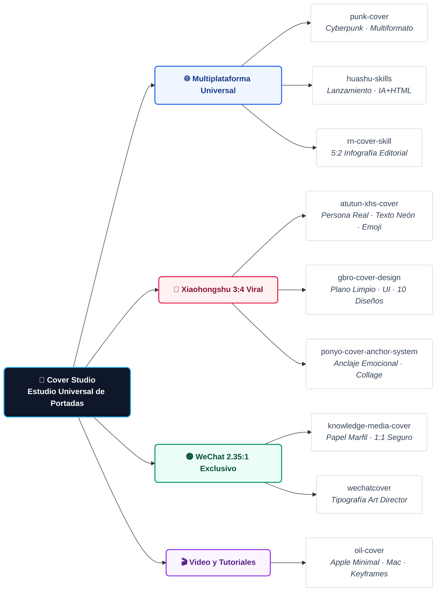

<div align="center">

[简体中文](README.md) · [English](README.en.md) · [日本語](README.ja.md) · [한국어](README.ko.md) · [**Español**](README.es.md)

# 🎨 Skill Universal de Portadas (Cover Studio)

### Flujo de Trabajo Todo en Uno para Portadas Virales · Integrado con 9 Motores de Código Abierto

Un Skill de IA de código abierto para creadores, desarrolladores y redactores. ¡Elimina la parálisis de elección! Al ingresar un artículo, **primero alinea la jerarquía de texto (titular grande + subtítulo + etiquetas)** y luego **genera directamente 3 conceptos de diseño en imagen o prompts simultáneamente**. Una vez que eliges tu estilo favorito, **selecciona libremente los formatos de plataforma para exportar en lote** y fijar tu Sistema de Marca (Brand System). Soporta **generación directa en Codex** y **prompts optimizados para Nano Banana (Google Flow gratis)**.


<br/>

Ideal para: **Notas virales de Xiaohongshu, cabeceras de WeChat, artículos de X/Twitter, miniaturas de YouTube y vistas previas de GitHub**.

</div>

---

## 💡 ¿Por qué creamos el "Skill Universal de Portadas"?

Como creador de contenido, desarrollador independiente o redactor técnico, seguro has vivido estos **dolores de cabeza al diseñar portadas**:

1. **🤯 Fatiga de herramientas y parálisis de elección**: Existen decenas de excelentes skills en GitHub (estilo Cyberpunk, Xiaohongshu, WeChat, Corporativo...). Cada vez que terminas un artículo, pierdes tiempo cambiando de herramienta y adivinando cuál funcionará mejor.
2. **📐 El "infierno de formatos" multiplataforma**: Deseas publicar en Xiaohongshu (3:4 vertical), WeChat (2.35:1 panorámico), X/Twitter (16:9 post / 5:2 artículo) y YouTube (16:9). El recorte mecánico tradicional corta textos y arruina la composición visual.
3. **✍️ Caos tipográfico y falta de jerarquía**: Muchas herramientas generan imágenes a ciegas, con textos confusos o titulares sin suficiente impacto visual.
4. **🎨 Falta de coherencia de marca**: Cambiar de estilo en cada publicación impide que la audiencia reconozca tu identidad de creador.

### 🎯 Nuestra Solución: ¡No reinventar la rueda, sino crear el director de orquesta definitivo!
> **En lugar de obligarte a instalar y alternar 10 skills fragmentados, Cover Studio actúa como un centro de control inteligente para todas tus portadas.**

- **Integración de 9 motores Open Source top**: Produce simultáneamente 3 opciones de estilos visuales diferenciados según tu contenido.
- **Alineación previa de jerarquía de texto**: Valida titular grande + subtítulo + etiquetas antes de generar.
- **3 estilos primero, luego exportación multiformato en lote**: Mira el resultado real, elige el ganador y exporta todas las plataformas.
- **Fijación del Sistema de Marca (Brand System)**: Guarda tu fórmula visual preferida para mantener consistencia a largo plazo.

---

## ✨ Características Principales

- ✍️ **Alineación Previa de Jerarquía de Texto**: Confirma el titular principal grande, subtítulo y etiquetas antes de generar las imágenes.
- 🖼️ **Generación Directa de 3 Estilos**: Produce 3 opciones completas con la tipografía alineada de forma simultánea.
- 📐 **Elegir Estilo y luego Expandir a Múltiples Formatos**: Selecciona tu estilo preferido y marca las plataformas deseadas (Xiaohongshu `3:4`, WeChat `2.35:1`, X Post `16:9`, X Artículo `5:2`, Video `16:9`, etc.) para entrega en lote.
- 🏷️ **Fijación de Sistema de Marca (Brand System)**: Guarda tu estilo elegido para mantener coherencia en todas las publicaciones.
- 🚀 **Generación Dual (Directa en Codex + Gratuita en Google Flow)**.
- 🔄 **Enrutamiento Inteligente entre 9 Motores de Portadas**.

---

## 🛠️ Flujo de Trabajo Estándar



---

## 📚 Matriz de 4 Corrientes y 9 Motores Integrados



| Corriente | Nombre del Motor | Repositorio GitHub | Características Visuales | Uso Recomendado |
|:---|:---|:---|:---|:---|
| **🌐 Multiplataforma** | `punk-cover` | [adrianpunk/Punk-Skill](https://github.com/adrianpunk/Punk-Skill) | Cyberpunk / Tecnología Moderna | Adaptable a 3:4, 2.35:1, 16:9, 5:2 |
| **🌐 Multiplataforma** | `huashu-skills` | [alchaincyf/huashu-skills](https://github.com/alchaincyf/huashu-skills) | Lanzamiento Empresarial / Diseño Industrial | IA + Renderizado Vectorial HTML |
| **🌐 Multiplataforma** | `rn-cover-skill` | [Pluviobyte/rnskill](https://github.com/Pluviobyte/rnskill) | 5:2 Infografía Editorial | Análisis técnico, reportes de investigación |
| **📕 Vertical 3:4** | `atutun-xhs-cover` | [panggungunvibe/atutun-xhs-cover](https://github.com/panggungunvibe/atutun-xhs-cover) | Persona Real / Texto Amarillo Neón / Stickers | Marca personal, guías prácticas |
| **📕 Vertical 3:4** | `gbro-cover-design` | [pyang5166/gbro-cover-design](https://github.com/pyang5166/gbro-cover-design) | Plano Limpio / Tarjetas UI / 10 Diseños | Reseñas de herramientas, software |
| **📕 Vertical 3:4** | `ponyo-cover-anchor-system` | [ponyodong2026/ponyo-cover-anchor-system](https://github.com/ponyodong2026/ponyo-cover-anchor-system) | Conflicto Emocional / Collage de Papel | Storytelling, ganchos de alto CTR |
| **🟢 Horizontal 2.35:1** | `knowledge-media-cover` | [aa1143/knowledge-media-cover](https://github.com/aa1143/knowledge-media-cover) | Papel Marfil / Metáfora Central | Artículos extensos (seguro para recorte 1:1) |
| **🟢 Horizontal 2.35:1** | `wechatcover` | [naplesblue/wechatcover](https://github.com/naplesblue/wechatcover) | Tipografía de Dirección de Arte | Boletines corporativos, identidad de marca |
| **🎬 Video y Tutoriales** | `oil-cover` | [oil-oil/oil-cover](https://github.com/oil-oil/oil-cover) | Minimalismo Apple / Ventana Mac | Grabaciones de código, tutoriales de IA |

---

## 📦 Instalación y Uso

```bash
git clone https://github.com/kaomei/cover-studio.git
cd cover-studio

# Codex CLI
cp -R skills/cover-studio "${CODEX_HOME:-$HOME/.codex}/skills/cover-studio"

# Antigravity / Gemini CLI
cp -R skills/cover-studio ~/.gemini/config/skills/cover_studio
```

---

## ⚠️ Aviso Legal

1. **Atribución de Código Abierto**: Este proyecto es una habilidad de enrutamiento; todos los derechos de autor de los 9 motores pertenecen a sus respectivos autores originales.
2. **Proyecto No Oficial**: No existe afiliación comercial oficial con las plataformas de redes sociales mencionadas ni con Google.
3. **Uso Permitido**: Para fines educativos, de investigación y creación legítima de contenido.

---

## 🤝 Contribuciones

¡Las sugerencias de nuevos motores y recetas de prompts son bienvenidas!

Si este proyecto te ha sido útil, **¡dale una ⭐️ Star para apoyar a kaomei (烤妹儿)!**

## 📄 Licencia

[MIT License](LICENSE) © 2026 [kaomei](https://github.com/kaomei)
