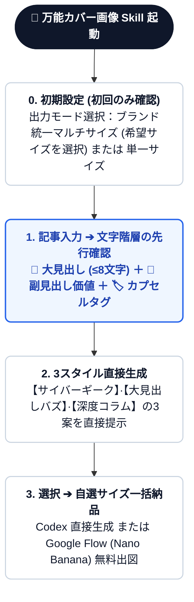
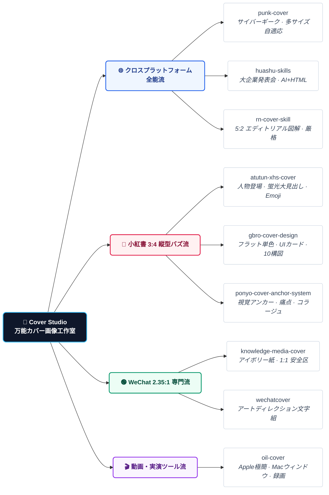

<div align="center">

[简体中文](README.md) · [English](README.en.md) · [**日本語**](README.ja.md) · [한국어](README.ko.md) · [Español](README.es.md)

# 🎨 万能カバー画像 Skill (Cover Studio)

### 全プラットフォーム対応・バズるカバー画像制作ワークフロー · 9大トップオープンソースエンジンを統合

クリエイター、個人開発者、テックブロガーのためのオープンソース AI Skill。初期設定で**明確に区分されたサイズ組み合わせを自由に選択**し、記事入力時に**大見出し・副見出し・タグ要素の文字階層をまず確認**。その文字を基に**3種類の異なるデザイン画像を直接生成・提示**します。ブランドシステム固定化機能に加え、**Codex 環境直接生成**と **Nano Banana (Google Flow 無料) プロンプト出力**に対応。


<br/>

適用シーン：**RED (小红书) 縦型画像、WeChat 公式アカウントヘッダー、X/Twitter 記事カバー、YouTube/Bilibili サムネイル、GitHub Social Preview**。

</div>

---

## 💡 なぜ「万能カバー画像 Skill」を作ったのか？

クリエイター、個人開発者、テックブロガーなら、誰もが一度は経験したことのある**「カバー画像制作の苦悩」**：

1. **🤯 ツールの選択疲れと迷い**：GitHub には素晴らしいカバー画像スキル（サイバー風、小紅書風、WeChat風、大企業風など）が多数存在しますが、毎回どのツールを使うべきか迷い、何度も試行錯誤する時間が無駄になっていました。
2. **📐 複数プラットフォーム配信の「画幅地獄」**：1本の記事を小紅書（3:4 縦型）、WeChat（2.35:1 超ワイド）、X/Twitter（16:9 / 5:2）、YouTube（16:9）に展開する際、1枚の画像を無理やりトリミングすると文字が切れたり構図が崩れてしまいます。
3. **✍️ 文字の乱れと情報階層の崩壊**：画像生成AIで文字が崩れたり、大見出しのフックが弱かったり、サブタイトルやタグが抜けてしまう問題。
4. **🎨 ブランド統一感の欠如**：投稿ごとにデザインがバラバラで、読者に自分のブランドを覚えてもらえない。

### 🎯 解決策：車輪の再発明ではなく、最高の一元ルーティングを！
> **10個の個別スキルを使い分ける手間をなくし、コンテンツ・画幅・ブランドを熟知した「万能カバー画像コマンダー」を構築しました！**

- **9大トップオープンソースエンジンを統合**：記事内容に応じた3つの異なる流派のデザインを直接提示。
- **文字階層の先行確認**：大見出し・副見出し・タグを確定させてから生成することで失敗を防止。
- **自選マルチサイズの一括出力**：お気に入りのスタイルを選べば、選択した各プラットフォーム向けに構図を最適化して一括生成。
- **ブランドVIのワンクリック固定**：選んだスタイルを記憶させ、継続的なブランド認知を確立。

---

## ✨ 主な特徴

- ⚙️ **初回明確なカスタムサイズ選択**：常時一括出力したいプラットフォームサイズ（RED 3:4、WeChat 2.35:1、X ポスト 16:9、X 長文 5:2、動画 16:9、GitHub 2:1、1:1 正方形等）をユーザー自身が個別にチェック設定。
- ✍️ **文字階層の先行確認ステップ**：大見出し、副見出し、タグ要素の文言を画像生成前に必ずユーザーと擦り合わせ。
- 🖼️ **3パターン直接生成**：確認された文字を基に、異なる3つの高品質デザイン画像を直接生成・提示。
- 🏷️ **ワンクリック・ブランドシステム固定**：気に入ったスタイルをブランド標準として保存。
- 📐 **3大黄金ルールに基づく再レイアウト**：画幅に応じた構図の再設計。
- 🚀 **Codex 直出 ＋ Google Flow (Nano Banana) 無料生成のデュアルパス対応**。
- 🔄 **9大オープンソースカバーエンジン統合**。

---

## 🛠️ 標準ワークフロー全行程



---

## 📚 4大流派 · 9大オープンソースエンジン



| 流派 | エンジン名 | GitHub リンク | ビジュアル特徴 | 適用シーン |
|:---|:---|:---|:---|:---|
| **🌐 クロスプラットフォーム** | `punk-cover` | [adrianpunk/Punk-Skill](https://github.com/adrianpunk/Punk-Skill) | サイバーギーク / 現代テック風 | 3:4、2.35:1、16:9、5:2 に自適応 |
| **🌐 クロスプラットフォーム** | `huashu-skills` | [alchaincyf/huashu-skills](https://github.com/alchaincyf/huashu-skills) | 大企業発表会 / インダストリアル | AI 生成 ＋ HTML ベクター描画 |
| **🌐 クロスプラットフォーム** | `rn-cover-skill` | [Pluviobyte/rnskill](https://github.com/Pluviobyte/rnskill) | 5:2 エディトリアル図解風 | 専門的な技術解説、調査レポート |
| **📕 縦型 3:4** | `atutun-xhs-cover` | [panggungunvibe/atutun-xhs-cover](https://github.com/panggungunvibe/atutun-xhs-cover) | 人物登場 / 蛍光大見出し / 絵文字 | 個人IP育成、実践ノウハウ共有 |
| **📕 縦型 3:4** | `gbro-cover-design` | [pyang5166/gbro-cover-design](https://github.com/pyang5166/gbro-cover-design) | フラット単色 / UI カード構図 | ツールレビュー、ソフトウェア解説 |
| **📕 縦型 3:4** | `ponyo-cover-anchor-system` | [ponyodong2026/ponyo-cover-anchor-system](https://github.com/ponyodong2026/ponyo-cover-anchor-system) | 感情フック / コラージュ風 | コラム、高クリック率フック |
| **🟢 横長 2.35:1** | `knowledge-media-cover` | [aa1143/knowledge-media-cover](https://github.com/aa1143/knowledge-media-cover) | アイボリー紙テクスチャ / 抽象概念 | 深度コラム（1:1 正方形クロップ対応） |
| **🟢 横长 2.35:1** | `wechatcover` | [naplesblue/wechatcover](https://github.com/naplesblue/wechatcover) | アートディレクション級文字組 | 企業ニュースレター、ブランド統一 |
| **🎬 動画・実演** | `oil-cover` | [oil-oil/oil-cover](https://github.com/oil-oil/oil-cover) | Apple風ミニマル / Macウィンドウ | プログラミング実演、AI ツール動画 |

---

## 📦 インストール方法

```bash
git clone https://github.com/kaomei/cover-studio.git
cd cover-studio

# Codex CLI
cp -R skills/cover-studio "${CODEX_HOME:-$HOME/.codex}/skills/cover-studio"

# Antigravity / Gemini CLI
cp -R skills/cover-studio ~/.gemini/config/skills/cover_studio
```

---

## ⚠️ 免責事項

1. **オープンソース統合について**：本プロジェクトはカバー画像デザインのルーティングスキルであり、統合されている9つのスキルの知的財産権は各原著作者に帰属します。
2. **非公式プロジェクト**：各ソーシャルメディアプラットフォームおよび Google との公式な提携関係はありません。
3. **利用範囲**：個人の学習、研究、適法なコンテンツ制作にご利用ください。

---

## 🤝 コントリビューション

PR や Issue での新しいエンジン推薦やプロンプトレシピの共有を歓迎します！

このプロジェクトがお役に立ちましたら、**ぜひ Star ⭐️ をつけて kaomei（烤妹儿）を応援してください！**

## 📄 ライセンス

[MIT License](LICENSE) © 2026 [kaomei](https://github.com/kaomei)
