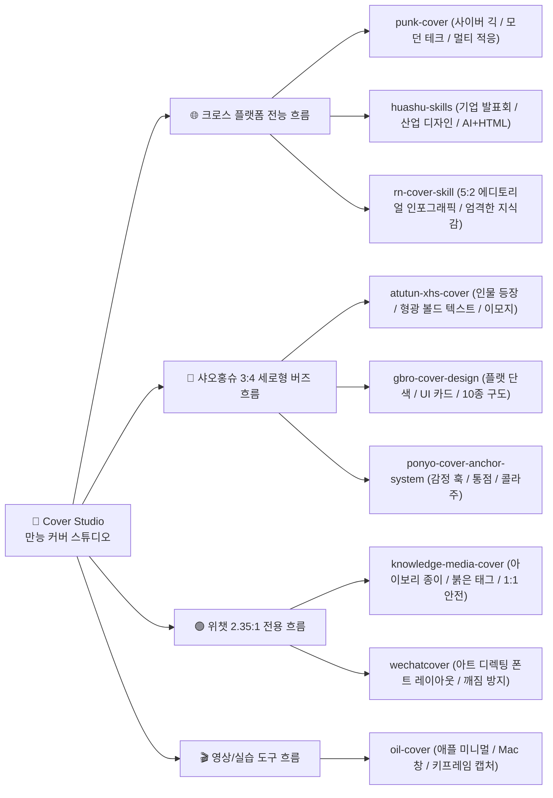

<div align="center">

[简体中文](README.md) · [English](README.en.md) · [日本語](README.ja.md) · [**한국어**](README.ko.md) · [Español](README.es.md)

# 🎨 만능 커버 Skill (Cover Studio)

### 올인원 멀티 플랫폼 썸네일 & 커버 워크플로우 · 9대 최고 오픈소스 커버 엔진 통합

크리에이터, 1인 개발자, 테크 블로거를 위한 오픈소스 AI Skill. 초기 설정에서 **명확히 구분된 플랫폼 규격 목록을 직접 체크**하고, 글 입력 시 **메인 헤드라인·서브 카피·태그 요소의 텍스트 계층을 먼저 확인**. 정렬된 문구를 바탕으로 **서로 다른 3가지 스타일 이미지를 즉시 생성·제시**합니다. 브랜드 시스템(Brand System) 고정은 물론, **Codex 환경 직접 생성**과 **Nano Banana (Google Flow 무료 플랫폼) 프롬프트 출력**의 듀얼 패스를 지원합니다.


<br/>

활용 분야: **샤오홍슈(小红书) 세로형 카드, 위챗 공식 계정 헤더, X/트위터 아티클 커버, 유튜브/치지직 썸네일, GitHub Social Preview**.

</div>

---

## ✨ 핵심 기능

- ⚙️ **명확한 플랫폼 규격 조합 설정**: 상시 일괄 출력할 개별 플랫폼 비율(샤오홍슈 `3:4`, 위챗 `2.35:1`, X 포스트 `16:9`, X 아티클 `5:2`, 영상 `16:9`, GitHub `2:1`, `1:1` 정사각 등)을 사용자가 직접 체크하여 저장.
- ✍️ **텍스트 계층 선행 확인**: 메인 대형 텍스트, 서브 카피, 캡슐 태그 문구를 이미지 생성 전에 미리 완벽하게 정렬.
- 🖼️ **3가지 스타일 즉시 생성**: 정렬된 텍스트를 바탕으로 3가지 서로 다른 고품질 완성작/프롬프트를 즉시 제시.
- 🏷️ **원클릭 브랜드 시스템(Brand System) 고정**: 마음에 드는 스타일을 브랜드 표준으로 저장.
- 📐 **화면비에 맞춘 지능형 재배치**: 선택된 비율에 맞게 구도와 여백을 자동 재구성.
- 🚀 **Codex 직접 생성 ＋ Google Flow (Nano Banana) 무료 생성 듀얼 패스**.
- 🔄 **9대 오픈소스 커버 엔진 통합 라우팅**.

---

## 🛠️ 표준 워크플로우 전체 흐름

```mermaid
flowchart TD
    subgraph S0["⚙️ 초기 설정 (최초 1회)"]
        A0["만능 커버 Skill 실행"] --> A1{"출력 모드 확인"}
        A1 -->|"멀티 사이즈 모드"| A2["상시 출력할 독립 규격 조합 체크:<br/>3:4 / 2.35:1 / X 16:9 / X장문 5:2 / 영상 16:9 / GitHub 2:1 / 1:1"]
        A1 -->|"단일 규격 모드"| A3["매번 단일 규격 개별 커스텀"]
    end

    subgraph S1["📝 1단계: 글 입력 및 텍스트 계층 확인"]
        B0["글/대본 입력"] --> B1["3대 텍스트 계층 자동 추출 및 확인:<br/>1. 📌 메인 대형 헤드라인 훅<br/>2. 📝 서브 카피 가치 설명<br/>3. 🏷️ 캡슐 태그 및 체크리스트"]
    end

    subgraph S2["🎨 2단계: 3가지 스타일 즉시 생성"]
        C0["사용자 텍스트 확인"] --> C1["확인된 텍스트로 3가지 스타일 이미지 즉시 생성:<br/>• 스타일 A: 사이버 긱 (punk-cover)<br/>• 스타일 B: 볼드 헤드라인 (atutun-xhs / ponyo)<br/>• 스타일 C: 심층 저널 (knowledge-media)"]
    end

    subgraph S3["🚀 3단계: 선택 및 자율 규격 최종 납품"]
        D0["사용자가 마음에 드는 스타일 선택"] --> D1{"0단계 초기 설정"}
        D1 -->|"멀티 사이즈 모드"| D2["체크한 전체 규격 일괄 출력:<br/>예: 3:4 + 2.35:1 + 16:9"]
        D1 -->|"단일 규격 모드"| D3["지정 규격 개별 출력"]
        D2 --> D4["Codex 직접 렌더링 또는 Google Flow 무료 가이드]
        D3 --> D4
    end

    A2 --> B0
    A3 --> B0
    B1 --> C0
    C1 --> D0
```

---

## 📚 4대 카테고리 · 9대 오픈소스 엔진 요약



| 카테고리 | 엔진명 | GitHub 링크 | 주요 비주얼 특징 | 추천 사용처 |
|:---|:---|:---|:---|:---|
| **🌐 크로스 플랫폼** | `punk-cover` | [adrianpunk/Punk-Skill](https://github.com/adrianpunk/Punk-Skill) | 사이버 긱 / 모던 테크풍 | 3:4, 2.35:1, 16:9, 5:2 자동 적응 |
| **🌐 크로스 플랫폼** | `huashu-skills` | [alchaincyf/huashu-skills](https://github.com/alchaincyf/huashu-skills) | 기업 발표회 / 산업 디자인 | AI 생성 ＋ HTML 벡터 렌더링 |
| **🌐 크로스 플랫폼** | `rn-cover-skill` | [Pluviobyte/rnskill](https://github.com/Pluviobyte/rnskill) | 5:2 에디토리얼 인포그래픽 | 전문 기술 분석, 리서치 보고서 |
| **📕 세로형 3:4** | `atutun-xhs-cover` | [panggungunvibe/atutun-xhs-cover](https://github.com/panggungunvibe/atutun-xhs-cover) | 인물 등장 / 형광 볼드 텍스트 / 이모지 | 1인 브랜딩, 노하우 팁 공유 |
| **📕 세로형 3:4** | `gbro-cover-design` | [pyang5166/gbro-cover-design](https://github.com/pyang5166/gbro-cover-design) | 깔끔한 플랫 / UI 카드 구도 | 툴 리뷰, 소프트웨어 튜토리얼 |
| **📕 세로형 3:4** | `ponyo-cover-anchor-system` | [ponyodong2026/ponyo-cover-anchor-system](https://github.com/ponyodong2026/ponyo-cover-anchor-system) | 감정적 훅 / 찢어진 종이 콜라주 | 스토리텔링, 고클릭률 훅 |
| **🟢 가로형 2.35:1** | `knowledge-media-cover` | [aa1143/knowledge-media-cover](https://github.com/aa1143/knowledge-media-cover) | 아이보리 종이 질감 / 추상 메타포 | 심층 아티클 (1:1 크롭 완벽 대응) |
| **🟢 가로형 2.35:1** | `wechatcover` | [naplesblue/wechatcover](https://github.com/naplesblue/wechatcover) | 아트 디렉팅급 폰트 레이아웃 | 기업 뉴스레터, 브랜드 정체성 확립 |
| **🎬 영상 실습** | `oil-cover` | [oil-oil/oil-cover](https://github.com/oil-oil/oil-cover) | 애플 감성 미니멀 / Mac 창 캡처 | 코딩 녹화, AI 도구 튜토리얼 영상 |

---

## 📦 설치 및 실행

```bash
git clone https://github.com/kaomei/cover-studio.git
cd cover-studio

# Codex CLI
cp -R skills/cover-studio "${CODEX_HOME:-$HOME/.codex}/skills/cover-studio"

# Antigravity / Gemini CLI
cp -R skills/cover-studio ~/.gemini/config/skills/cover_studio
```

---

## ⚠️ 면책 조항 (Disclaimer)

1. **오픈소스 통합 안내**: 본 프로젝트는 커버 디자인 라우팅 스킬이며, 통합된 9개 스킬의 모든 권리는 원저작자에게 있습니다.
2. **비공식 프로젝트**: 언급된 플랫폼 및 Google과 공식적인 상업적 제휴 관계가 없습니다.
3. **사용 범위**: 개인 학습, 연구 및 합법적인 콘텐츠 제작에 활용하시기 바랍니다.

---

## 🤝 기여 안내

새로운 오픈소스 커버 엔진 추천 및 프롬프트 레시피 PR을 환영합니다!

이 프로젝트가 마음에 드셨다면, **Star ⭐️를 눌러 kaomei(烤妹儿)를 응원해주세요!**

## 📄 라이선스

[MIT License](LICENSE) © 2026 [kaomei](https://github.com/kaomei)
