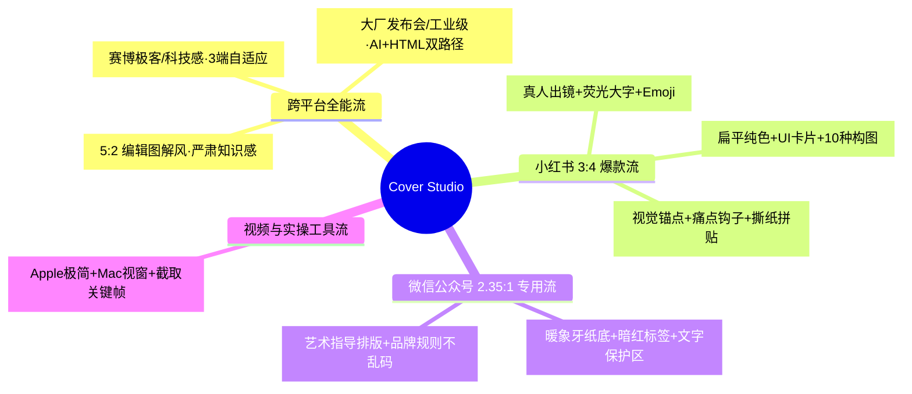
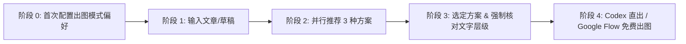

<div align="center">

[**简体中文**](README.md) · [English](README.en.md) · [日本語](README.ja.md) · [한국어](README.ko.md) · [Español](README.es.md)

# 🎨 Cover Studio (万能封面工作室)

### 一站式全平台爆款封面选型与生成工作流 · 集成 9 大顶级开源封面引擎

一款专为自媒体创作者、独立开发者、专栏作家与科技博主打造的开源 AI Skill。告别封面选择困难症与风格大乱炖！安装即问出图偏好，输入文章内容**自动并行输出 3 种最匹配的风格排版方案**；强制核对**大字主标题与小文字标签层级**；支持一键固化个人品牌系统（Brand System），支持 **Codex 环境直接出图** 与 **Nano Banana (Google Flow 免费平台) 提示词** 双路径交付。


<br/>

适用于：**小红书爆款图文、微信公众号头图、X/Twitter 深度长文、B站/YouTube 视频封面、即刻与 GitHub Social Preview**。

</div>

---

## ✨ 核心亮点 (Key Features)

- ⚙️ **安装即问出图模式**：首次使用即确认偏好——是“选定风格后一次性批量出多平台多尺寸（小红书3:4、公众号2.35:1、X 16:9/5:2 等）”，还是“单尺寸独立定制”。
- 🧠 **三方案并行推荐**：输入文章内容后，自动从知识图谱与风格库中同时提炼 3 组截然不同的高契合度排版方案，拒绝单选题盲猜。
- ✍️ **文字层级强制核对机制**：选定方案后，每次严格与用户对齐【大字主标题】、【副标题阐述】与【小文字/胶囊标签元素】，确保信息层级清晰、主次分明。
- 🏷️ **品牌系统一键固化 (Brand System)**：用户选定方案后，可一键将其保存为个人专属品牌 VI，让未来全年的封面“不看作者名就知道是你”。
- 📐 **三大黄金铁律画幅重排**：严格依据小红书（`3:4`）、公众号（`2.35:1`）、X（`16:9` / `5:2`）进行视觉动线重排，杜绝机械裁剪。
- 🚀 **直出生图 + Nano Banana 免费双路径**：
  - **Codex / 本地环境**：秒级直接调用生图工具渲染高清成图。
  - **标准对话环境**：输出针对 **Nano Banana** 深度调优的英文 Prompt，可在 **Google Flow (flow.google)** 平台完全免费出图。
- 🔄 **9 大顶级开源封面引擎全集成**：融合社区星标最高、经过实战验证的 9 款开源 Skill，无需重复安装即可一站式调度。

---

## 📚 4 大流派 · 9 大开源封面引擎速查矩阵



| 流派 | 引擎名 | GitHub 仓库 | 核心视觉特征 | 最佳适配场景 |
|:---|:---|:---|:---|:---|
| **🌐 跨平台全能** | `punk-cover` | [adrianpunk/Punk-Skill](https://github.com/adrianpunk/Punk-Skill) | 赛博极客 / 现代科技风 / 虚拟人设 | 3:4、2.35:1、5:2 三端自适应 |
| **🌐 跨平台全能** | `huashu-skills` | [alchaincyf/huashu-skills](https://github.com/alchaincyf/huashu-skills) | 大厂发布会 / 工业级设计 / 品牌 Token | AI 生图 ＋ HTML 矢量渲染 |
| **🌐 跨平台全能** | `rn-cover-skill` | [Pluviobyte/rnskill](https://github.com/Pluviobyte/rnskill) | 5:2 编辑图解风 / 暖白底粗黑大字 | 深度技术拆解、行业严肃研究 |
| **📕 小红书 3:4** | `atutun-xhs-cover` | [panggungunvibe/atutun-xhs-cover](https://github.com/panggungunvibe/atutun-xhs-cover) | 真人出镜 / 荧光黄大字 / 勾选框贴纸 | 个人 IP 孵化、副业搞钱、干货教程 |
| **📕 小红书 3:4** | `gbro-cover-design` | [pyang5166/gbro-cover-design](https://github.com/pyang5166/gbro-cover-design) | 纯色扁平 / 产品主视觉 / 对比卡片 | 工具测评、软件使用说明 |
| **📕 小红书 3:4** | `ponyo-cover-anchor-system` | [ponyodong2026/ponyo-cover-anchor-system](https://github.com/ponyodong2026/ponyo-cover-anchor-system) | 情绪冲突 / 痛点钩子 / 涂鸦撕纸拼贴 | 情感疗愈、认知跃迁、故事专栏 |
| **🟢 公众号 2.35:1** | `knowledge-media-cover` | [aa1143/knowledge-media-cover](https://github.com/aa1143/knowledge-media-cover) | 暖象牙纸底 / 暗红标签 / 居中概念图 | 深度长文、机构号（通过 1:1 居中测试） |
| **🟢 公众号 2.35:1** | `wechatcover` | [naplesblue/wechatcover](https://github.com/naplesblue/wechatcover) | 艺术指导级排版 / 品牌配色固化 | 专业专栏、企业 VI 规范封面 |
| **🎬 视频实操** | `oil-cover` | [oil-oil/oil-cover](https://github.com/oil-oil/oil-cover) | Apple 极简 / Mac 视窗外壳 / 真实录屏 | 编程录屏、AI 工具实操视频 |

---

## 🛠️ 标准创作工作流 (Workflow)



1. **首次偏好确认**：首次使用时，确认常用模式（统一品牌多尺寸分发 vs 单尺寸定制）。
2. **输入文案**：在对话中粘贴你的文章标题、提纲或完整口播。
3. **三方案并行**：Cover Studio 自动完成语义拆解，输出 3 种截然不同的构图与 Prompt 方案。
4. **文字层级精准对齐**：选定方案后，核对【大字主标题】、【副标题】与【小标签】，支持一键微调。
5. **极速出图**：Codex 环境一键直出成品图，或复制 Prompt 到 Google Flow 平台使用 Nano Banana 免费出图。

---

## 📋 提示词生成与文字对齐范例 (Example Alignment)

### 案例：文章《AI 时代，个人超级个体的商业闭环与搞钱指南》

```text
🎨 已为您深度分析文章内容，生成 3 组最匹配的封面排版方案：

---
【方案 1：赛博极客风（基于 punk-cover 理念）】
📐 画幅：16:9（X / 即刻）
💡 构图：深灰网格背景上悬浮发光的 3D 算力芯片与金色齿轮，左侧排版无衬线大标题
📝 Prompt: High-end editorial tech cover illustration, aspect ratio 16:9, clean off-white background with subtle circuit grid...

---
【方案 2：小红书爆款大字风（基于 atutun-xhs 理念）】
📐 画幅：3:4（小红书竖版）
💡 构图：顶部亮黄色高对比度标题卡片「普通人翻盘」+ Q版人物手托发光钱袋 + 勾选框
📝 Prompt: Viral Xiaohongshu style lifestyle & knowledge guide cover, vertical 3:4, bright warm lighting...

---
【方案 3：微信公众号深度长文风（基于 knowledge-media 理念）】
📐 画幅：2.35:1（公众号横幅）
💡 构图：暖象牙纸质底色 #F7F5EE，暗红分类标签「深度商业」，居中抽象商业飞轮插画
📝 Prompt: Sophisticated editorial publication header banner, ultra-wide 2.35:1, warm fine ivory paper texture background...

--------------------------------------------------
【文字层级核对环节】（用户选择方案 2 后触发）
1. 📌 大字主标题：普通人翻盘
2. 📝 副标题：AI 时代个人商业闭环与实操指南
3. 🏷️ 小标签元素：[实操干货] · ✔ 0门槛 · ✔ 附 Prompt
```

---

## 📦 安装与使用 (Installation & Quick Start)

### 1. 安装 Skill 至你的 AI 环境

克隆本项目仓库：

```bash
git clone https://github.com/kaomei/cover-studio.git
cd cover-studio
```

复制到对应的 skills 目录：

```bash
# Codex CLI
cp -R skills/cover-studio "${CODEX_HOME:-$HOME/.codex}/skills/cover-studio"

# Antigravity / Gemini CLI
cp -R skills/cover-studio ~/.gemini/config/skills/cover_studio
```

### 2. 在对话中随时唤醒

在对话中输入：

```text
使用 $cover-studio 为我这篇公众号文章设计封面：

文章标题：DeepSeek 爆火背后，普通人如何抓住第一波红利？
文章内容：[粘贴你的文章正文或核心大纲]
```

---

## ⚠️ 免责声明与版权提示 (Disclaimer)

1. **开源集成说明**：本项目（`cover-studio`）为一个开源的封面设计路由与工程规范 Skill，**文中所引用的 9 款开源 Skill 其所有知识产权均归原作者所有**，在此致以崇高敬意。
2. **非官方合作声明**：本 Skill 与文中所提及的任何自媒体平台（小红书、微信、X、Google Flow 等）均无官方商业合作或代言背书。
3. **合法合规使用**：生成的提示词与设计方案仅供个人学习、技术研究与合规的内容创作使用，请勿用于侵权或违规商业行为。

---

## 🤝 欢迎贡献 (Contributing)

欢迎提交 Issue 或 Pull Request 推荐更多优质的开源封面引擎、分享爆款排版案例！

如果这个项目帮你解决了封面排版与风格难题，**请给项目点一个 ⭐️ Star 支持烤妹儿！**

---

## 📄 开源协议 (License)

本项目源码遵循 [MIT License](LICENSE) © 2026 [kaomei](https://github.com/kaomei)。
