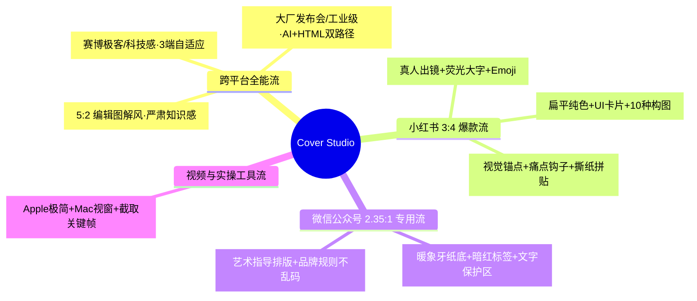

<div align="center">

[**简体中文**](README.md) · [English](README.en.md) · [日本語](README.ja.md) · [한국어](README.ko.md) · [Español](README.es.md)

# 🎨 Cover Studio (万能封面工作室)

### 一站式全平台爆款封面选型与生成工作流 · 集成 9 大顶级开源封面引擎

一款专为自媒体创作者、独立开发者、专栏作家与科技博主打造的开源 AI Skill。告别封面选择困难症与风格大乱炖！安装即让用户**自主勾选常用尺寸组合**；输入文章内容**首先确认大字标题/副标题/标签文字层级**；随后**直接并行输出 3 种不同风格的成图或提示词**；选定后支持**全平台自选尺寸一键批量出图**与品牌固化，支持 **Codex 环境直接出图** 与 **Nano Banana (Google Flow 免费平台) 提示词** 双路径交付。


<br/>

适用于：**小红书爆款图文、微信公众号头图、X/Twitter 深度长文、B站/YouTube 视频封面、即刻与 GitHub Social Preview**。

</div>

---

## ✨ 核心亮点 (Key Features)

- ⚙️ **安装即自主勾选尺寸组合**：首次使用时，用户可自主勾选常驻批量输出的画幅组合（如小红书 `3:4`、公众号 `2.35:1`、X `16:9/5:2`、视频 `16:9`、GitHub `2:1` 等），永久记忆。
- ✍️ **文字层级先行确认机制**：输入文案后，第一时间与用户精准核对【大字主标题】、【副标题价值点】与【小文字/胶囊标签】，杜绝文字乱码与主次不清。
- 🖼️ **3 种风格直接成图/出提示词**：文字确认后直接并行生成 3 种不同流派的高清成图或完整 Prompt，不给空洞文字选项，所见即所得。
- 🏷️ **品牌系统一键固化 (Brand System)**：用户选定方案后，可一键将其保存为个人专属品牌 VI，让未来全年的封面“不看作者名就知道是你”。
- 📐 **三大黄金铁律画幅重排**：严格依据选中的目标画幅进行视觉动线重排，杜绝机械拉伸或切掉主体。
- 🚀 **直出生图 + Nano Banana 免费双路径**：
  - **Codex / 本地环境**：秒级直接调用生图工具渲染高清成图。
  - **标准对话环境**：输出针对 **Nano Banana** 深度调优的英文 Prompt，可在 **Google Flow (flow.google)** 平台完全免费出图。
- 🔄 **9 大顶级开源封面引擎全集成**：融合社区星标最高、经过实战验证的 9 款开源 Skill，无需重复安装即可一站式调度。

---

## 🛠️ 标准交互全流程图 (Standardized Workflow)

```mermaid
flowchart TD
    subgraph S0["⚙️ 首次配置 (仅首次安装/唤醒时确认)"]
        A0[用户安装/唤醒 Skill] --> A1[确认出图偏好模式:<br/>• 模式 1: 🌟 统一品牌多尺寸分发模式<br/>• 模式 2: 🎯 单尺寸独立定制模式]
        A1 -->|选择模式 1| A2[用户自主勾选常驻批量输出的画幅组合:<br/>小红书 3:4 / 公众号 2.35:1 / X 16:9 / 视频 16:9 / GitHub 2:1 等]
    end

    subgraph S1["📝 阶段一：文章录入与文字层级核对 (每次必须)"]
        B0[用户输入文章/标题/口播草稿] --> B1[Skill 自动提取并与用户精准核对 3 大文字层级:<br/>1. 📌 大字主标题 (≤6-8字，高反差吸睛核心)<br/>2. 📝 副标题 (10-15字，阐明具体价值)<br/>3. 🏷️ 小标签元素 (胶囊标签/勾选框/痛点短词)]
    end

    subgraph S2["🎨 阶段二：基于确认文字，直接并行出 3 种风格图 / Prompt"]
        C0[用户确认文字内容] --> C1[基于确认的文字，直接并行生成 3 套不同流派的高清成图 / 完整 Prompt:<br/>• 风格 A: 赛博极客/科技感 (基于 punk-cover)<br/>• 风格 B: 爆款干货/大字视觉锚点 (基于 atutun-xhs / ponyo)<br/>• 风格 C: 深度专栏/典雅知识流 (基于 knowledge-media)]
    end

    subgraph S3["🚀 阶段三：用户挑选 ➔ 自选多尺寸一键批量交付"]
        D0[用户选定心仪风格 (A / B / C)] --> D1{根据阶段 0 预设偏好}
        D1 -->|统一品牌多尺寸模式| D2[一键批量交付阶段 0 勾选的全部尺寸资产:<br/>例如: 小红书 3:4 + 公众号 2.35:1 + X 16:9]
        D1 -->|单尺寸定制模式| D3[交付当前画幅专属版本]
        D2 --> D4[Codex 本地一键直出成图 OR 输出 Google Flow Nano Banana 免费出图指引]
        D3 --> D4
    end

    S0 --> S1 --> S2 --> S3
```

---

## 📚 4 大流派 · 9 大开源封面引擎速查矩阵



| 流派 | 引擎名 | GitHub 仓库 | 核心视觉特征 | 最佳适配场景 |
|:---|:---|:---|:---|:---|
| **🌐 跨平台全能** | `punk-cover` | [adrianpunk/Punk-Skill](https://github.com/adrianpunk/Punk-Skill) | 赛博极客 / 现代科技风 / 虚拟人设 | 3:4、2.35:1、5:2 三端自适应 |
| **🌐 跨平台全能** | `huashu-skills` | [alchaincyf/huashu-skills](https://github.com/alchaincyf/huashu-skills) | 大厂发布会 / 工业级设计 / 品牌 Token | AI 生图 ＋ HTML 矢量渲染 |
| **🌐 跨平台全能** | `rn-cover-skill` | [Pluviobyte/rnskill](https://github.com/Pluviobyte/rnskill) | 5:2 编辑图解风 / 暖白底粗黑大字 | 深度技术拆解、行业严肃研究 |
| **📕 小红书 3:4** | `atutun-xhs-cover` | [panggungunvibe/atutun-xhs-cover](https://github.com/panggungunvibe/atutun-xhs-cover) | 真人出镜 / 荧光黄大字 / 勾选框贴纸 | 个人 IP 孵化、副业搞钱、干货教程 |
| **📕 小红书 3:4** | `gbro-cover-design` | [pyang5166/gbro-cover-design](https://github.com/pyang5166/gbro-cover-design) | 纯色扁平 / 产品主视觉 / 对比卡片 | 工具测评、软件使用说明 |
| **📕 小红书 3:4** | `ponyo-cover-anchor-system` | [ponyodong2026/ponyo-cover-anchor-system](https://github.com/ponyodong2026/ponyo-cover-anchor-system) | 情绪冲突 / 痛点钩子 / 涂鸦撕纸拼贴 | 情感疗愈、认知跃迁、故事专栏 |
| **🟢 公众号 2.35:1** | `knowledge-media-cover` | [aa1143/knowledge-media-cover](https://github.com/aa1143/knowledge-media-cover) | 暖象牙纸底 / 暗红标签 / 居中概念图 | 深度长文、机构号（通过 1:1 居中测试） |
| **🟢 公众号 2.35:1** | `wechatcover` | [naplesblue/wechatcover](https://github.com/naplesblue/wechatcover) | 艺术指导级排版 / 品牌配色固化 | 专业专栏、企业 VI 规范封面 |
| **🎬 视频实操** | `oil-cover` | [oil-oil/oil-cover](https://github.com/oil-oil/oil-cover) | Apple 极简 / Mac 视窗外壳 / 真实录屏 | 编程录屏、AI 工具实操视频 |

---

## 📋 交互与直出范例 (Example Walkthrough)

### 步骤 0：首次偏好与自定义尺寸勾选
> **用户首次运行 Skill**：
> ```markdown
> 请勾选您日常运营需要常驻批量输出的平台画幅组合：
> 1. [x] 📕 小红书 / 抖音图文 (3:4)
> 2. [x] 🟢 微信公众号首图 (2.35:1，通过 1:1 居中测试)
> 3. [x] 🐦 X / Twitter / 即刻 (16:9 / 5:2)
> 4. [ ] 🎬 B站 / YouTube 视频封面 (16:9)
> 5. [ ] 💻 GitHub Social Preview / 博客 (2:1)
> 6. [ ] 🔲 正方形配图 / 朋友圈 (1:1)
> ```

### 步骤 1：文章录入与文字核对
> **用户输入**：“文章标题《AI 时代，个人超级个体的商业闭环与搞钱指南》，请帮我做封面。”  
> **Skill 回复**：
> ```markdown
> 👌 已深度分析内容！在为您直接生成 3 套封面之前，请先核对文字排版层级：
> 1. 📌 大字主标题：普通人翻盘（≤8字，超大字高对比）
> 2. 📝 副标题：AI 时代个人商业闭环与实操指南（10-15字）
> 3. 🏷️ 小标签元素：[实操干货] · ✔ 0门槛 · ✔ 附 Prompt
> 👉 请确认文字是否符合预期？（回复“确认”即直接生成 3 种风格封面）
> ```

### 步骤 2：用户确认 ➔ 直接输出 3 种风格成图/Prompt
> **用户回复**：“确认”  
> **Skill 回复**：直接并行输出风格 A（赛博极客）、风格 B（小红书大字）、风格 C（公众号深度长文）的完整成图或 Prompt。

### 步骤 3：选定风格 ➔ 批量交付自选的全部尺寸
> **用户回复**：“选 B”  
> **Skill 回复**：自动批量输出风格 B 在**小红书 3:4**、**公众号 2.35:1**、**X 16:9** 下的全套自适应成品图或 Prompt！

---

## 📦 安装与使用 (Installation & Quick Start)

### 1. 安装 Skill 至你的 AI 环境

克隆本项目仓库：

```bash
git clone https://github.com/kaomei/cover-studio.git
cd cover-studio
```

复制到对应的 skills 目录：

```bash
# Codex CLI
cp -R skills/cover-studio "${CODEX_HOME:-$HOME/.codex}/skills/cover-studio"

# Antigravity / Gemini CLI
cp -R skills/cover-studio ~/.gemini/config/skills/cover_studio
```

### 2. 在对话中随时唤醒

在对话中输入：

```text
使用 $cover-studio 为我这篇公众号文章设计封面：

文章标题：DeepSeek 爆火背后，普通人如何抓住第一波红利？
文章内容：[粘贴你的文章正文或核心大纲]
```

---

## ⚠️ 免责声明与版权提示 (Disclaimer)

1. **开源集成说明**：本项目（`cover-studio`）为一个开源的封面设计路由与工程规范 Skill，**文中所引用的 9 款开源 Skill 其所有知识产权均归原作者所有**，在此致以崇高敬意。
2. **非官方合作声明**：本 Skill 与文中所提及的任何自媒体平台（小红书、微信、X、Google Flow 等）均无官方商业合作或代言背书。
3. **合法合规使用**：生成的提示词与设计方案仅供个人学习、技术研究与合规的内容创作使用，请勿用于侵权或违规商业行为。

---

## 🤝 欢迎贡献 (Contributing)

欢迎提交 Issue 或 Pull Request 推荐更多优质的开源封面引擎、分享爆款排版案例！

如果这个项目帮你解决了封面排版与风格难题，**请给项目点一个 ⭐️ Star 支持烤妹儿！**

---

## 📄 开源协议 (License)

本项目源码遵循 [MIT License](LICENSE) © 2026 [kaomei](https://github.com/kaomei)。
