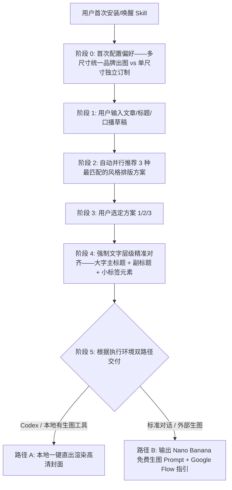

# 🎨 Cover Studio (万能封面工作室)

`cover-studio` 是一站式解决全平台封面选择困扰的 AI Skill。无需在数十个独立封面工具间反复纠结，它通过智能路由机制，将社区最成熟的 **9 大开源封面引擎** 融会贯通，遵循「三大黄金铁律」，提供从**首次偏好配置 ➔ 风格推荐 ➔ 标题文字层级确认 ➔ 双路径交付**的标准化工作流。

---

## 🧭 核心交互流程 (Standardized Workflow)



---

## 阶段 0：首次安装与出图模式配置 (First-Run Preference Intake)

在用户首次安装或首次唤醒 Skill 时，**第一时间主动与用户确认出图模式偏好**：

> **“欢迎使用 Cover Studio 万能封面工作室！🐻✨ 为方便未来极速出图，请先告诉我您的常用出图偏好：”**
> 
> 1. 🌟 **【统一品牌多尺寸分发模式】（推荐）**：选定 1 个风格方案后，自动为您**一次性批量输出全部多平台自适应尺寸**（默认包含：小红书 `3:4`、微信公众号 `2.35:1`、X/推特 `16:9` / `5:2`、视频横版 `16:9` 等），保持全网统一品牌识别度。
> 2. 🎯 **【单尺寸独立定制模式】**：每次只针对当前指定的单一画幅单独挑选和定制不同风格。
> 
> *(该偏好可随时在对话中调整)*

---

## 阶段 1 & 2：文章录入与三方案并行推荐 (3-Style Proposals)

用户输入文章标题、长文或口播草稿后，Skill 自动解析主题属性与情绪张力，**同时输出 3 种截然不同但最契合内容的排版风格方案**：

### 输出方案示例：
```markdown
🎨 已为您深度分析文章内容，生成 3 组最匹配的封面排版方案：

---
### 方案 1：【赛博极客 · 现代科技流】（基于 punk-cover 理念）
- 📐 **推荐画幅**：X 16:9 / 5:2 或 小红书 3:4
- 💡 **视觉隐喻**：发光芯片在冷调灰网格上浮空旋转，左侧留出高对比度无衬线主标题
- 🎯 **适合场景**：AI 评测、开发者工具、Vibe Coding 技术教程

---
### 方案 2：【爆款干货 · 大字视觉锚点流】（基于 atutun-xhs / ponyo 理念）
- 📐 **推荐画幅**：小红书 3:4 竖版
- 💡 **视觉隐喻**：暖色明亮背景，顶部大字荧光黄色标题卡片 + 趣味表情包/人物手势痛点指引
- 🎯 **适合场景**：搞钱攻略、自媒体实操、小红书高 CTR 点击收割

---
### 方案 3：【深度专栏 · 典雅知识自媒体流】（基于 knowledge-media 理念）
- 📐 **推荐画幅**：微信公众号 2.35:1 / 全平台头图
- 💡 **视觉隐喻**：暖白高级纸张质感底色，暗红小标签分割，居中优雅抽象概念插画（1:1 方块安全区）
- 🎯 **适合场景**：商业深度观察、行业专栏、机构号品牌沉淀

---
👉 **请回复您心仪的方案编号（1 / 2 / 3），或提出微调要求！**
```

---

## 阶段 3 & 4：方案选定与【文字层级强制对齐】(Mandatory Text Alignment)

用户选定方案编号（如“选方案 2”）后，Skill **每次必须与用户明确核对封面文字元素**，确保大字、副标题与小标签清晰准确、主次分明：

```markdown
👌 已为您锁定【方案 2：爆款干货大字风】！

为确保最终成图的文字排版冲击力与信息层级，请与我核对以下文字配置（可直接确认或修改）：

1. 📌 **大字主标题 (Main Headline)**：`普通人翻盘` （≤6-8字，最核心的吸睛痛点词，采用超大字高对比呈现）
2. 📝 **副标题 / 补充文案 (Sub-headline)**：`AI 时代个人商业闭环与实操指南` （10-15字，解释具体价值）
3. 🏷️ **小文字与标签元素 (Pill Badges & Tags)**：
   - 分类胶囊标签：`[实操干货]` / `[2026最新]`
   - 勾选框/痛点短词：`✔ 0门槛` · `✔ 附 Prompt 模板` · `✔ 一键复用`

👉 **请确认上述文字是否符合预期？如有修改请直接告知！**
```

---

## 阶段 5：双路径交付机制 (Dual-Path Delivery)

文字确认完毕后，根据用户环境完成最终交付：

### 路径 A：Codex / 本地具备生图环境
- 直接调用工具（如 `generate_image` / DALL-E / Imagen）一键完成画面渲染。
- 将高清成品图写入工作区并提供下载链接。

### 路径 B：无本地生图环境 ➔ Nano Banana / Google Flow 免费直出
- 输出经过精心架构调优的 **Nano Banana 英文生图提示词**（包含精准文字占位与安全区指令）。
- 提供保姆级免费出图指引：
  > 💡 **免费出图指引**：打开 **[Google Flow 平台 (flow.google)](https://flow.google)**，选择免费的 **Nano Banana** 模型，将上方英文 Prompt 粘贴进去，即可免费生成超清大图！

---

## 🌟 封面选型的「三大黄金铁律」

1. **画幅决定构图，切忌硬裁**：
   - 小红书（`3:4` 垂直动线）、公众号（`2.35:1` 扁平横幅）、X/推特（`5:2` 或 `16:9` 极宽视野）。
   - 针对画幅重新组织主视觉与留白，严禁机械拉伸。
2. **分清 Prompt 派 vs 直出派**：
   - **Prompt 派**：生成高质量提示词，适合去 Google Flow (Nano Banana)、Midjourney 等细致出图。
   - **直出派**：利用环境工具或 HTML 矢量渲染秒出成品。
3. **建立固定品牌系统 (Brand System)**：
   - 让读者“不看作者名就知道是你”，保持色调、字体、留白的一致性。

---

## 📚 集成的 9 大开源封面引擎速查

| 流派 | 引擎名 | GitHub 地址 | 特色风格 | 最佳适配场景 |
|---|---|---|---|---|
| **跨平台全能** | `punk-cover` | [adrianpunk/Punk-Skill](https://github.com/adrianpunk/Punk-Skill) | 赛博极客 / 现代科技风 | 3:4 / 2.35:1 / 5:2 三端自适应，可配虚拟人设 |
| **跨平台全能** | `huashu-skills` | [alchaincyf/huashu-skills](https://github.com/alchaincyf/huashu-skills) | 大厂发布会 / 工业级设计 | AI 生图 + HTML 矢量渲染双路径 |
| **跨平台全能** | `rn-cover-skill` | [Pluviobyte/rnskill](https://github.com/Pluviobyte/rnskill) | 5:2 编辑图解风 | 暖白底 + 粗黑大标题 + 概念主图，严肃知识感 |
| **小红书 3:4** | `atutun-xhs-cover` | [panggungunvibe/atutun-xhs-cover](https://github.com/panggungunvibe/atutun-xhs-cover) | 真人出镜 + 荧光黄大字 | 小红书百万干货排版逻辑，单选题引导 |
| **小红书 3:4** | `gbro-cover-design` | [pyang5166/gbro-cover-design](https://github.com/pyang5166/gbro-cover-design) | 纯色扁平 / 产品主视觉 | 10种高频构图，UI 界面卡片挂接 |
| **小红书 3:4** | `ponyo-cover-anchor-system` | [ponyodong2026/ponyo-cover-anchor-system](https://github.com/ponyodong2026/ponyo-cover-anchor-system) | 情绪冲突 + 涂鸦撕纸拼贴 | 视觉锚点与痛点钩子，专治低点击率 |
| **公众号 2.35:1** | `knowledge-media-cover` | [aa1143/knowledge-media-cover](https://github.com/aa1143/knowledge-media-cover) | 暖象牙纸底 + 暗红标签 | 专属文字保护区，整年封面长得像一家人 |
| **公众号 2.35:1** | `wechatcover` | [naplesblue/wechatcover](https://github.com/naplesblue/wechatcover) | 艺术指导级精准排版 | 固化 brand_system.md，中文不乱码 |
| **视频实操** | `oil-cover` | [oil-oil/oil-cover](https://github.com/oil-oil/oil-cover) | Apple 极简 + Mac 视窗 | 截取视频关键帧，3:4 / 4:3 / 16:9 多端输出 |

---

## 🛠️ 参考文档导航
- 详细引擎特性解析：[references/skills-catalog.md](references/skills-catalog.md)
- 各平台画幅与避让安全区：[references/platform-specs.md](references/platform-specs.md)
- 提示词配方与 Nano Banana 指引：[references/prompt-recipes.md](references/prompt-recipes.md)
- 品牌固化系统配置模板：[references/brand-system.md](references/brand-system.md)
