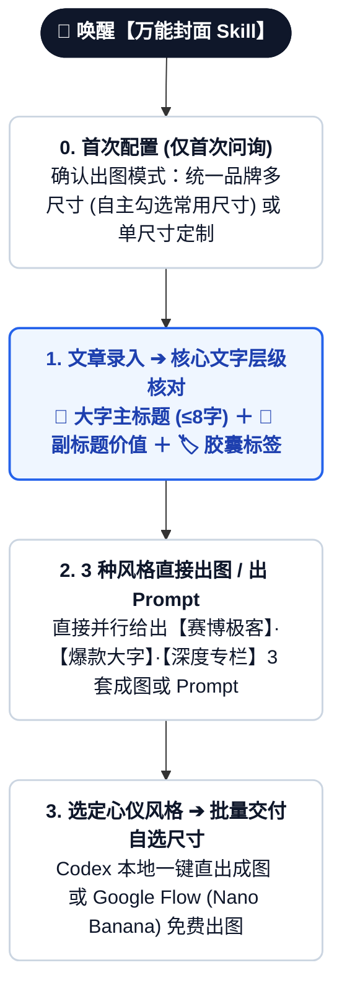

# 🎨 万能封面 Skill (Cover Studio)

`cover-studio` 是一站式解决全平台封面制作与排版困扰的 AI Skill。无需在数十个独立封面工具间纠结，它通过智能路由机制，将社区最成熟的 **9 大开源封面引擎** 融会贯通，提供从**独立尺寸清单配置 ➔ 文字层级精准确认 ➔ 3 种风格直接出图/出提示词 ➔ 自选尺寸一键批量交付**的极简闭环。

---

## 🧭 标准交互全流程图 (Standardized Workflow)



---

## 阶段 0：首次配置出图模式与【独立尺寸清单勾选】(First-Run Intake)

在用户首次安装或首次唤醒【万能封面 Skill】时，**第一时间与用户确认模式并呈现清晰拆分的单项尺寸清单**（仅需配置一次，永久记忆）：

> **“欢迎使用【万能封面 Skill】(Cover Studio)！🐻✨ 为方便后续极速出图，请先告诉我您的常用出图偏好：”**
> 
> 1. 🌟 **【统一品牌多尺寸分发模式】（推荐）**：每次选定 1 个心仪风格后，自动为您**一次性批量输出您自选的多项独立平台尺寸**，全网视觉高度统一。
> 2. 🎯 **【单尺寸独立定制模式】**：每次只针对当前指定的单一画幅单独定制不同风格。

当用户选择 **【统一品牌多尺寸分发模式】** 时，Skill **引导用户自主勾选清晰无歧义的单项尺寸清单**：

```markdown
👌 请勾选您日常运营需要常驻批量输出的独立平台尺寸（可直接回复编号组合，如 `1+2+3` 或 `全部`）：

- [x] 1. 📕 **小红书 / 抖音图文** (`3:4` 竖版，1080×1440)
- [x] 2. 🟢 **微信公众号首图** (`2.35:1` 超宽横幅，2350×1000，通过 1:1 居中测试)
- [x] 3. 🐦 **X / Twitter / 即刻推文配图** (`16:9` 标准横屏，1200×675)
- [ ] 4. 📰 **X Article / 专栏深度长文头图** (`5:2` 极宽横幅，1200×480)
- [ ] 5. 🎬 **B站 / YouTube 视频封面** (`16:9` 高清横版，1920×1080)
- [ ] 6. 💻 **GitHub Social Preview / 博客头图** (`2:1` 横版卡片，1280×640)
- [ ] 7. 🔲 **通用方形配图 / 朋友圈 / 头像** (`1:1` 正方形，1080×1080)

未来每次选定风格后，【万能封面 Skill】将为您一次性批量生成上述全部选中尺寸！
```

---

## 阶段 1：文章录入与【文字层级强制核对】(Text Alignment)

用户输入文章标题、长文或口播草稿后，Skill **首先提取核心信息并强制与用户核对 3 大文字层级**：

```markdown
👌 已深度分析您的文章内容！在为您直接生成 3 套不同风格封面之前，请先核对文字排版层级：

1. 📌 **大字主标题 (Main Headline)**：`普通人翻盘` （≤6-8字，最核心痛点，超大字高对比度呈现）
2. 📝 **副标题 / 价值阐述 (Sub-headline)**：`AI 时代个人商业闭环与实操指南` （10-15字，阐释具体价值）
3. 🏷️ **小文字与标签元素 (Pill Badges & Tags)**：
   - 分类胶囊标签：`[实操干货]` / `[2026最新]`
   - 勾选亮点短词：`✔ 0门槛` · `✔ 附 Prompt 模板` · `✔ 一键复用`

👉 **请确认文字是否符合预期？（直接回复“确认”或直接告知修改意见）**
```

---

## 阶段 2：基于确认文字，直接生成 3 组风格成图/提示词 (Direct 3-Style Generation)

用户确认文字后，Skill **直接并行生成 3 种完全不同流派的完整作品/Prompt**：

- **Codex / 本地环境**：直接调用绘图工具生成 3 张高清成品图展示；
- **标准对话环境**：直接输出 3 套完整的、包含确认文字指令的 **Nano Banana 英文生图 Prompt**。

### 输出范例：
```markdown
🎨 已根据确认的文字层级，为您直接生成 3 种不同流派的封面结果：

---
### 🖼️ 风格 A：【赛博极客 · 现代科技流】（基于 punk-cover 理念）
- 📐 **画幅**：16:9（X / 即刻 / 科技专栏）
- 💡 **画面**：冷调灰网格背景，发光 3D 芯片悬浮，左侧极简排版大字「普通人翻盘」与标签「实操干货」
- 📝 **直接可用生图 Prompt**：
```text
High-end editorial tech cover illustration, aspect ratio 16:9, clean off-white background with subtle circuit grid, glowing cyan and electric purple accents. Centerpiece: a stylized minimalist 3D rendering of glowing GPU microchips. Text overlay: bold headline "普通人翻盘", sub-headline "AI 时代个人商业闭环与实操指南", pill badge "[实操干货]". Sleek isometric perspective, professional studio lighting, 8k resolution.
```

---
### 🖼️ 风格 B：【爆款干货 · 大字视觉锚点流】（基于 atutun-xhs / ponyo 理念）
- 📐 **画幅**：3:4（小红书竖版）
- 💡 **画面**：明亮暖色底，顶部亮黄色高反差大字标题卡片「普通人翻盘」，配 Q 版手势与清单勾选框
- 📝 **直接可用生图 Prompt**：
```text
Viral Xiaohongshu style knowledge guide cover, vertical 3:4 aspect ratio, vibrant and friendly atmosphere. Bright warm lighting, soft pastel background. Upper section features large bold typographic hook area with high-contrast yellow text card reading "普通人翻盘", supporting text "AI 时代个人商业闭环与实操指南", and checklist items "✔ 0门槛", "✔ 附 Prompt 模板".
```

---
### 🖼️ 风格 C：【深度专栏 · 典雅知识自媒体流】（基于 knowledge-media 理念）
- 📐 **画幅**：2.35:1（微信公众号首图，通过 1:1 居中测试）
- 💡 **画面**：暖象牙纸质底色 #F7F5EE，暗红小标签「实操干货」，居中抽象商业飞轮与大字标题
- 📝 **直接可用生图 Prompt**：
```text
Sophisticated editorial publication header banner, ultra-wide 2.35:1 aspect ratio, warm fine ivory paper texture background #F7F5EE. Centered visual composition: elegant conceptual illustration with restrained deep crimson and slate gray accents. Typography: centered clean headline "普通人翻盘", subtitle "AI 时代个人商业闭环与实操指南".
```

---
👉 **请回复您选中的风格（A / B / C）！**
```

---

## 阶段 3：用户挑选 ➔ 自选尺寸清单一键批量交付与免费出图指引

用户回复选定风格（如“选 B”）后：
1. **按自定义尺寸清单批量出图（若处于统一品牌模式）**：
   - 自动基于选中的风格 B，一键输出阶段 0 中用户勾选的**全部独立尺寸资产**（例如同时输出小红书 3:4、公众号 2.35:1、X 16:9、X长文 5:2 的成图或专属 Prompt）！
2. **免费出图操作指引（无本地生图环境时提供）**：
   > 💡 **Google Flow 免费生图指南**：
   > 1. 打开 **[Google Flow 平台 (flow.google)](https://flow.google)**；
   > 2. 模型选择免费的 **Nano Banana**；
   > 3. 粘贴上述英文 Prompt，即可免费秒出超清封面大图！

---

## 📚 4 大流派 · 9 大开源封面引擎速查表

| 流派 | 引擎名 | GitHub 地址 | 特色风格 | 最佳适配场景 |
|---|---|---|---|---|
| **跨平台全能** | `punk-cover` | [adrianpunk/Punk-Skill](https://github.com/adrianpunk/Punk-Skill) | 赛博极客 / 现代科技风 | 3:4 / 2.35:1 / 16:9 / 5:2 多端自适应，可配虚拟人设 |
| **跨平台全能** | `huashu-skills` | [alchaincyf/huashu-skills](https://github.com/alchaincyf/huashu-skills) | 大厂发布会 / 工业级设计 | AI 生图 + HTML 矢量渲染双路径 |
| **跨平台全能** | `rn-cover-skill` | [Pluviobyte/rnskill](https://github.com/Pluviobyte/rnskill) | 5:2 编辑图解风 | 暖白底 + 粗黑大标题 + 概念主图，严肃知识感 |
| **小红书 3:4** | `atutun-xhs-cover` | [panggungunvibe/atutun-xhs-cover](https://github.com/panggungunvibe/atutun-xhs-cover) | 真人出镜 + 荧光黄大字 | 小红书百万干货排版逻辑，单选题引导 |
| **小红书 3:4** | `gbro-cover-design` | [pyang5166/gbro-cover-design](https://github.com/pyang5166/gbro-cover-design) | 纯色扁平 / 产品主视觉 | 10种高频构图，UI 界面卡片挂接 |
| **小红书 3:4** | `ponyo-cover-anchor-system` | [ponyodong2026/ponyo-cover-anchor-system](https://github.com/ponyodong2026/ponyo-cover-anchor-system) | 情绪冲突 + 涂鸦撕纸拼贴 | 视觉锚点与痛点钩子，专治低点击率 |
| **公众号 2.35:1** | `knowledge-media-cover` | [aa1143/knowledge-media-cover](https://github.com/aa1143/knowledge-media-cover) | 暖象牙纸底 + 暗红标签 | 专属文字保护区，整年封面长得像一家人 |
| **公众号 2.35:1** | `wechatcover` | [naplesblue/wechatcover](https://github.com/naplesblue/wechatcover) | 艺术指导级排版 | 固化 brand_system.md，中文不乱码 |
| **视频实操** | `oil-cover` | [oil-oil/oil-cover](https://github.com/oil-oil/oil-cover) | Apple 极简 + Mac 视窗 | 截取视频关键帧，3:4 / 4:3 / 16:9 多端输出 |

---

## 🛠️ 参考文档导航
- 详细引擎特性解析：[references/skills-catalog.md](references/skills-catalog.md)
- 各平台画幅与文字层级规范：[references/platform-specs.md](references/platform-specs.md)
- 提示词配方与 Nano Banana 指引：[references/prompt-recipes.md](references/prompt-recipes.md)
- 品牌固化系统配置模板：[references/brand-system.md](references/brand-system.md)
