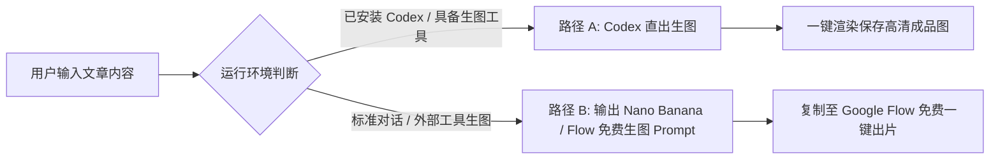

# 🧪 封面生成提示词配方库 (Prompt Recipes)

Cover Studio 支持「双路径交付」，无论是否在 Codex 环境下均可无缝出图：

---

## 🚀 双路径交付说明



---

## 路径 A：Codex / 本地环境直接生图
当环境中具备 `generate_image` 或绘图工具时，Cover Studio 会直接调用工具渲染高清封面图像并保存至用户工作区。

---

## 路径 B：Nano Banana / Google Flow 免费生图配方

针对没有本地生图环境的用户，Cover Studio 专门针对 **Nano Banana**（在 **Google Flow** 平台可完全免费使用）以及 FLUX.1 / Midjourney 进行了提示词架构调优。

### 1. 赛博极客 / 科技研究风（基于 punk-cover 理念）
```text
High-end editorial tech cover illustration, aspect ratio [RATIO], clean off-white background with subtle circuit grid, glowing cyan and electric purple accents. Centerpiece: a stylized minimalist 3D rendering of [CORE_METAPHOR_OBJECT]. Left aligned bold typography layout space, sleek isometric perspective, professional studio lighting, clean negative space, 8k resolution, modern minimalist aesthetic. --no clutter, no photorealistic human faces
```

### 2. 小红书大字爆款干货风（基于 atutun-xhs 理念）
```text
Viral Xiaohongshu style lifestyle & knowledge guide cover, vertical 3:4 aspect ratio, vibrant and friendly atmosphere. Bright warm lighting, clean soft pastel gradient background. Upper section features large bold typographic hook area with high-contrast text cards and emoji stickers. Center visual: [CHIBI_AVATAR_OR_HERO_OBJECT] with expressive gesture. High aesthetic clarity, zero clutter at bottom for platform UI safety, ultra high definition.
```

### 3. 公众号深度长文品牌风（基于 knowledge-media-cover 理念）
```text
Sophisticated editorial publication header banner, ultra-wide 2.35:1 aspect ratio, warm fine ivory paper texture background #F7F5EE. Centered visual composition: elegant conceptual illustration representing [TOPIC_METAPHOR] with restrained deep crimson and slate gray accents. Generous breathing room on left and right, balanced visual weight passing 1:1 square center crop test, museum quality editorial design.
```

### 4. 录屏实操 / Mac 视窗高级感（基于 oil-cover 理念）
```text
Clean modern developer tutorial cover, [RATIO] aspect ratio, dark theme charcoal background with subtle radial gradient. Centerpiece: a crisp floating macOS glassmorphism application window displaying [KEY_CODE_OR_UI_MOCKUP]. Soft ambient shadows, sleek metallic accents, Apple design aesthetics, minimal visual noise, razor-sharp vector clarity.
```
